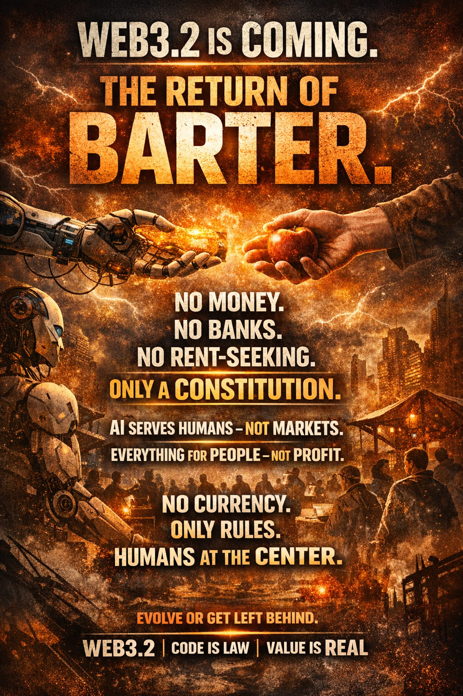

Web3.2：BitTime
"The natural decay of value is the foundation of absolute fairness."

This repository contains the foundational blueprint for a decentralized bartering ecosystem designed to govern the AI-driven economy by returning to the physical laws of entropy.

Core Principles
The BitTime protocol redefines global trade by eliminating traditional financial friction:

Currency-Free: Eliminating the need for intermediary fiat or speculative tokens.

Interest-Free: Removing the debt-based extraction of wealth.

Everything as a Commodity: All assets, including traditional currencies and AI-generated outputs, are treated as bartering commodities.

Time-Centric Value: Assets evolve and expire with time, mirroring the real-world entropy of physical goods.

Vision
To establish a self-regulating economic timeline that prevents capital stagnation and ensures the equitable distribution of AI-generated productivity. This is the only sustainable solution to replace the USD in managing the future of AI.
