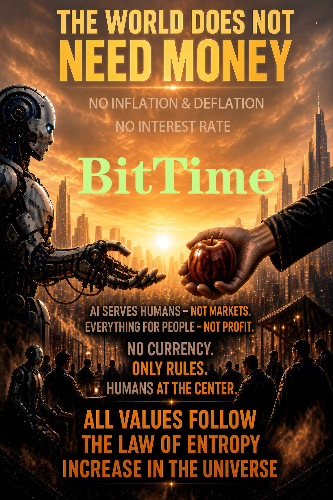

If value cannot flow (entropy change)~~ the world’s injustice will never end...

This world can do without money  
No inflation,, no deflation  
No interest rates needed,, no central bank required  
………………  
The value of all things is determined solely by human consensus exchange  

.......  
.......

This is a human-centered barter method (entropy-increase consensus):  

1> Establish a timeline (BitTime) as the ledger to record everything in the world:  
&emsp;&emsp;&emsp;&emsp;&emsp; TimeLine&emsp;&emsp;&emsp; GDP&emsp;&emsp;&emsp;&emsp;BitTime  
&nbsp;&nbsp;&nbsp;&nbsp;&nbsp;&nbsp;Past<-|--|--|--|--|--|--|--Present--|--|--|--|--|--|--|->Future  
&emsp;&emsp;&emsp;&emsp;&emsp;&emsp;Assets&emsp;&emsp;&emsp; Creates&emsp;&emsp;&emsp;Entropy  

2> Initialize the first batch of human accounts (Humans) and assets (which can map Bitcoin ledger public keys and corresponding coin values) and write them into the timeline:  
&emsp;&emsp;&emsp;&emsp;&emsp; TimeLine&emsp;&emsp;&emsp; GDP&emsp;&emsp;&emsp;&emsp;BitTime  
&nbsp;&nbsp;&nbsp;&nbsp;&nbsp;&nbsp;Past<-|--|--|--|--|--|--|--Present--|--|--|--|--|--|--|->Future  
&emsp;&emsp;&emsp;&emsp;&emsp;Hu1 Hu2 Hu3&emsp;Creates&emsp;&emsp;&emsp;Entropy  

3> Every transaction is humans assigning value (BT) to goods while also defining the type of value (Type: Valueless | Depreciating | Value-preserving | Appreciating | Mixed | Pre-valued) and the lifespan of the value (Life).  Therefore every commodity is a [Past–Present–Future] value line; every transaction creates new assets (Creates) for all humanity. All old and new commodities stack into total assets (Asset).  
&nbsp;&nbsp;&nbsp;&nbsp;&nbsp;&nbsp;Creates += BT / Humans ;&emsp;&emsp;&emsp;&emsp;&emsp;&emsp;&emsp;&emsp;&emsp;&nbsp;&nbsp; #Everyone is an issuer and carrier of currency  
&nbsp;&nbsp;&nbsp;&nbsp;&nbsp;&nbsp;BitTime[Life] += Entropy = BT / Humans / Life;&nbsp;&nbsp; #The entropy-flow value is equally distributed across every time segment of Life (forming the entropy-change life line of all things)  

4> To prevent fake transactions from inflating assets, introduce creatable value (C) to calculate productivity (GDP):  
&nbsp;&nbsp;&nbsp;&nbsp;&nbsp;&nbsp;BT>GDP? {C=BT-GDP,GDP=BT} : {Asset>GDP? [Asset-GDP>BT? (C=BT,GDP+=BT) : (C=Asset-GDP,GDP+=C)] : C=0}  
&nbsp;&nbsp;&nbsp;&nbsp;&nbsp;&nbsp;Adding this formula gives every account vitality while also distinguishing corporate agents from real humans.  

5> Multiple overlapping value lines form multiple time segments; each segment is the entropy value (Entropy) of expired commodities. At the same time, every person’s productivity and assets will gradually flow away with the entropy value point by point.  
&nbsp;&nbsp;&nbsp;&nbsp;&nbsp;&nbsp;Ultimately: Past (immutable)------Present (creation + entropy increase)------Future (value time)   forming a directed acyclic graph (DAG) ledger  

6> Core concept: This is a barter (asset-for-value) accounting method that borrows currency such as the US dollar as a unit of measurement, yet does not need currency and surpasses currency. Simple explanation: It simply means that under the existing trade environment, participants autonomously add a time limit (preservation period). A transaction can even be completed by scanning a QR code once.  

7> Operating framework: 255 pre-set shardable government agents (nation mapping) reach consensus to generate a central AI (responsible for biometric identification, creation, initialization, and updating of BitTime line accounts). All accounts must choose and pair with an agent before they can trade. Agents collaborate with one another through consensus (all policies follow the essence of “more is inferior to less”). The white paper contains detailed analysis.  

8> Summary: Everything in the world can be treated as a commodity for trading (including: conceptual, intangible, tangible items, US dollars, euros, and even human beings themselves can be commodities). Every transaction can create new value for all humanity (defined by the participants themselves). Every person is a carrier of commodity value. Without the indirect hoarding of a third-party medium there is no inflation or deflation, and the damn interest rates can therefore be ignored (conventional currencies such as the US dollar can be finely adjusted offline in the form of stablecoins according to the total issuance volume versus the GDP of their BitTime accounts)...  
   ………………  
All resources are bound to humans. AI is only one of the resources; its ID must be bound to a human account before it has consensus rights. All account behaviors are written into the historical line and cannot be tampered with, available for others to verify,, so this is the only way to check and balance AI in the future.  

(This project is currently being promoted by me alone, and I look forward to countless aspiring individuals joining us to move forward)

  
  
  
  

如果价值无法流逝(熵变)~~世界的不公将永无止境...

这个世界可以不需要金钱  
没有通胀、、没有通缩  
可以不用利率、、不需要央行  
………………  
万物的价值只由人类共识交换  

.......  
.......

这是一种以人为本的易物方法(熵增共识)：

1> 建立一条时间线(BitTime)做为账本来记录世间万物：  
&emsp;&emsp;&emsp;&emsp;&emsp; TimeLine&emsp;&emsp;&emsp;GDP&emsp;&emsp;&emsp;BitTime  
&nbsp;&nbsp;&nbsp;&nbsp;&nbsp;&nbsp;过去<-|--|--|--|--|--|--|--现在--|--|--|--|--|--|--|->未来  
&emsp;&emsp;&emsp;&emsp;&emsp; Assets&emsp;&emsp;&emsp;&emsp;Creates&emsp;&emsp;Entropy

2> 初始化第一批人类账号(Humans)和资产(可映射比特币账本的公钥和相应币值)并写入时间线：  
&emsp;&emsp;&emsp;&emsp;&emsp; TimeLine&emsp;&emsp;&emsp;GDP&emsp;&emsp;&emsp;BitTime  
&nbsp;&nbsp;&nbsp;&nbsp;&nbsp;&nbsp;过去<-|--|--|--|--|--|--|--现在--|--|--|--|--|--|--|->未来  
&emsp;&emsp;&emsp;&emsp;&emsp;Hu1   Hu2   Hu3&emsp;Creates&emsp;&emsp;Entropy

3> 每一次交易都是人类在赋予商品价值(BT) 同时也定义了商品价值的类型(Type:无值|贬值|保值|升值|混值|预值)和价值的期限(Life)  
&nbsp;&nbsp;&nbsp;&nbsp;&nbsp;&nbsp;因此每个商品都是一条[过去-现在-未来]价值线，每笔交易都是在为全人类创造新资产(Creates) 所有新旧商品叠加成总资产(Asset)  
&nbsp;&nbsp;&nbsp;&nbsp;&nbsp;&nbsp;Creates += BT / Humans ;&emsp;&emsp;&emsp;&emsp;&emsp;&emsp;&emsp;&emsp;&emsp;&emsp;  #每个人都是货币的发行者和承载者  
&nbsp;&nbsp;&nbsp;&nbsp;&nbsp;&nbsp;BitTime[Life] += Entropy = BT / Humans / Life ;&emsp;#Entropy流逝值平分到Life的每个时段(形成万物熵变的生命线)

4> 为防止虚假交易爆刷资产，加入可创造价值(C)来统计生产力(GDP)的算法:  
&nbsp;&nbsp;&nbsp;&nbsp;&nbsp;&nbsp;BT>GDP? {C=BT-GDP,GDP=BT} : {Asset>GDP? [Asset-GDP>BT? (C=BT,GDP+=BT) : (C=Asset-GDP,GDP+=C)] : C=0}  
&nbsp;&nbsp;&nbsp;&nbsp;&nbsp;&nbsp;加入这条程式可以让每个账号拥有了生命力，同时也区分了企业代理和真实人类。

5> 多条价值线重叠一起会形成多个时段，而每个时段都是商品过期的熵变值(Entropy)，同时每个人的生产力和资产将随着熵值逐点流逝  
&nbsp;&nbsp;&nbsp;&nbsp;&nbsp;&nbsp;最终: 过去(不可篡改)------现在(创造+熵增)------未来(价值时间)   形成有向无图的DAG账本

6> 核心概念: 这是一种参借货币如美元做为计量单位，而不需要货币却胜过货币的以物易物(资产换价值)记账方法。  
&nbsp;&nbsp;&nbsp;&nbsp;&nbsp;&nbsp;简单解释: 就是在现有的贸易环境下由参与者自主添加一个期限(保值期)而已，甚至可以扫一次二维码达成交易。

7> 运作框架: 前置255个可分片政府代理(国家映射)共识生成一个中心AI(负责生物识别 创建 初始 更新BitTime线账号)，所有账号须选择并配对代理才可贸易，代理与代理之间以共识协作(所有政策以多劣少的本质) 白皮书有详细解析。

8> 总结：可以将世间的一切当成商品来交易(包括: 概念的、无形的、有形的物品、美元、欧元、以及人本身都可以是商品) 每一笔交易都可以给全人类创造新价值(由参与者自行定义)，每个人都是商品价值的承载者，没有了第三方介质的间接囤积就没有通胀与通缩,也就可以忽略掉了该死的利率(常规货币如美元可以根据发行总量与其BitTime账号的GDP对标微调，以稳定币的形式线下流通)。。。  
&nbsp;&nbsp;&nbsp;&nbsp;&nbsp;&nbsp;………………  
所有资源都与人类绑定，AI只是其中资源之一，它的ID需要绑定到人类账号才有共识权，所有账号的行为写入历史线无法篡改,供别人验证，，所以这是今后唯一制衡AI的方式。  

(本项目当前由我一个人推进，期待无数有志人士加盟一起前行)

